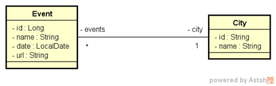

# bds02
Projeto da Semana 2 do Bootcamp da DevSuperior, empregando a metodologia TDD.

Implementar as funcionalidades necessárias para que os testes do projeto abaixo passem:
https://github.com/devsuperior/bds02

Este é um sistema de eventos e cidades com uma relação N-1 entre eles:

